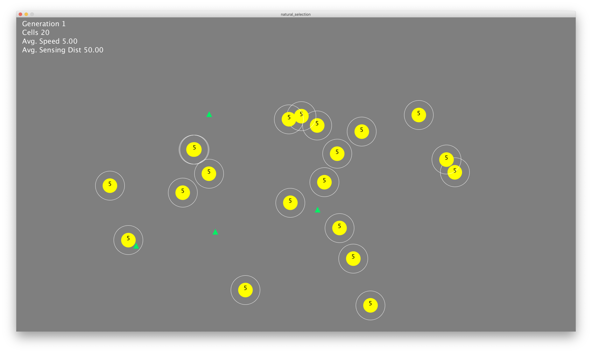

# Natural Selection Simulation

Simulation of natural selection and genetic evolution using Processing 3.
Added a new features.

## Features

Each cell has 2 features:

- Moving speed (Number in cells)
- Sensing distance (White circles around cells)

## Dependency

- Processing 3
- Python mode

## V2

- The Green Cells (Evolving Sensing distance)
- The Red Cells (Evolving Moving speed)
